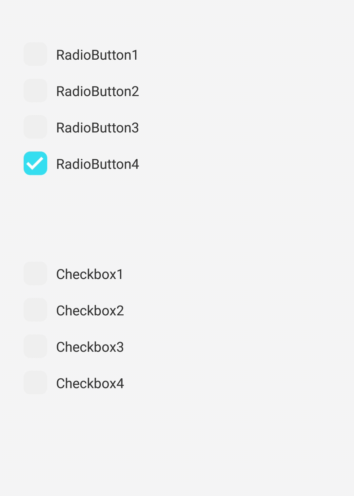

<h1>Introduction</h1>

INTUZ is presenting a radiobutton/checkbox list control to integrate inside your React Native based application for both Android and iOS platforms. Please follow below steps to integrate this control in your next project.

<br>
<h1>Features</h1>
- Support for Checkbox list
- Support for Radio list
- Control maximum selected items
- Clear all selection and select all options
- Customizable style and icons

<br>


<h1>Getting Started</h1>

> Import RadioCheckBox in your .js file

```
import RadioCheckBox from './app/component/INTRadioCheckbox/RadioCheckBox';     
```

> Define your option array with label and selected as mandatory field.

```
var options =  [
                { label: 'Checkbox1',selected:0},
                { label: 'Checkbox2',selected:1 },
                { label: 'Checkbox3',selected:0},
                { label: 'Checkbox4',selected:0 }
               ];
```

> Render RadioCheckBox

```
<RadioCheckBox checkOptions={options} 
        ref={"radioCheckbox"}
        maxSelected={1}
        onSelectionChange={(option)=> {console.log('Selected option ==' +  option)}}></RadioCheckBox>
```
> Select all options in a list.

```
this.refs.radioCheckbox.selectAllOptions();
```
> Clear all options in a list.

```
this.refs.radioCheckbox.clearAllSelection();
```
> Get all selected options in a list.

```
this.refs.radioCheckbox.getSelectedOptions((options)=>{
      
      console.log("selected options==",options);
    });
```
> Set selected options in a list.

```
var selected=[];
    selected.push(1);
    selected.push(3);
    this.refs.radioCheckbox.setSelectedOptins(selected);
```
<br>
<h1>Properties</h1>

| Available properties | Type | Default Value | Required | Description |
|--------------------------|------------------------|-------------------------------|----------|-------------------------------------------------------------------------------------------------------------------------------------------------------------------------|
| checkOptions | Array | - | Yes | Array of objects in below format: [ {label: 'Checkbox1',selected:0}, {label:'Checkbox2',selected:1}, { label:'Checkbox3',selected:0}, { label:'Checkbox4',selected:1 }] |
| maxSelected | Number | All | No | To restrict maximum number of items that can be selected at a time. Note: if value is 1 then it will work like radio button list |
| disabled | Boolean (true | false) | false | No | If true then component is not clickable. |
| listStyle | Style | {marginVertical:10} | No | Style your list |
| checkIcon | Image | - | No | Display selected item icon |
| unCheckIcon | Image | - | No | Display deselected item icon |
| isHorizontal | Boolean (true | false) | false | - | If true then option list display as horizontal list |
| optionStyle | Style | {color:'#2D2D2D'}, | No | To apply label style |
| optionIndicator | Style | {marginRight:5,marginLeft:10} | No | Icon style |
| onSelectionChange | function | - | No | Callback function. |
| selectAllOptions() | Method | - | - | To select all options |
| clearAllSelection() | Method | - | - | To clear all selected option |
| getSelectedOptions() | Method | - | - | To get all selected options |
| setSelectedOptins(array) | Method | - | - | To set selected options. Pass array of index of selected items. |                                                                                                         |
<br>
<h1>Bugs and Feedback</h1>

For bugs, questions and discussions please use the Github Issues.

<br>
<h1>License</h1>

Copyright (c) 2018 Intuz Solutions Pvt Ltd.
<br><br>
Permission is hereby granted, free of charge, to any person obtaining a copy of this software and associated documentation files (the "Software"), to deal in the Software without restriction, including without limitation the rights to use, copy, modify, merge, publish, distribute, sublicense, and/or sell copies of the Software, and to permit persons to whom the Software is furnished to do so, subject to the following conditions:
<br><br>
THE SOFTWARE IS PROVIDED "AS IS", WITHOUT WARRANTY OF ANY KIND, EXPRESS OR IMPLIED, INCLUDING BUT NOT LIMITED TO THE WARRANTIES OF MERCHANTABILITY, FITNESS FOR A PARTICULAR PURPOSE AND NONINFRINGEMENT. IN NO EVENT SHALL THE AUTHORS OR COPYRIGHT HOLDERS BE LIABLE FOR ANY CLAIM, DAMAGES OR OTHER LIABILITY, WHETHER IN AN ACTION OF CONTRACT, TORT OR OTHERWISE, ARISING FROM, OUT OF OR IN CONNECTION WITH THE SOFTWARE OR THE USE OR OTHER DEALINGS IN THE SOFTWARE.

<h1></h1>
<a href="http://www.intuz.com">

</a>